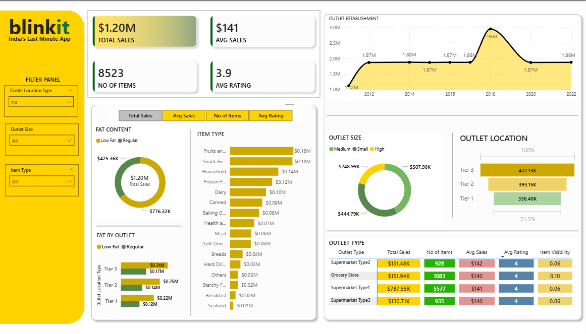
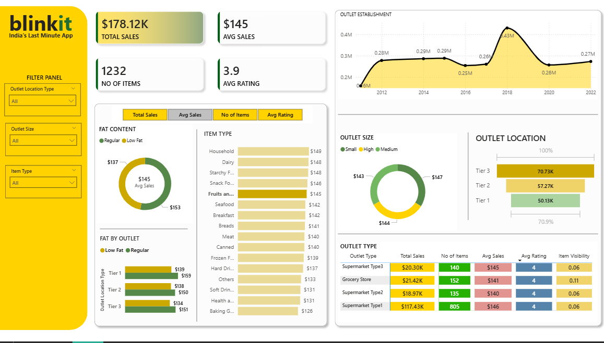
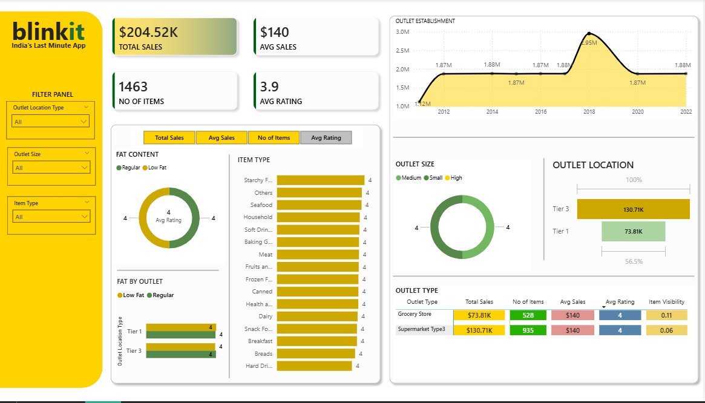
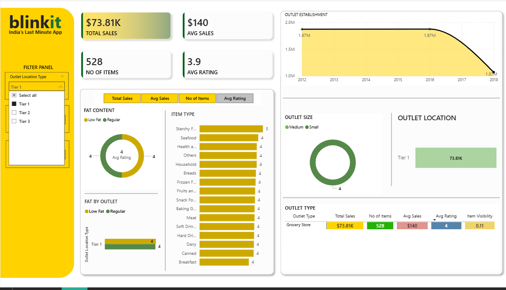

# Blinkit Sales Dashboard (Power BI)

## 📊 Overview
This project analyzes Blinkit sales data to provide insights into outlet performance, product categories, and customer trends using Power BI.

## 🚀 Features
- KPI tracking (Total Sales, Avg Sales, No. of Items, Avg Rating)
- Outlet analysis by size, type, and location
- Product category performance analysis
- Interactive filters and slicers
- Time-based sales trends

## 🛠 Tools & Technologies
- Power BI
- DAX
- Data Modeling

## 📌 Key Insights
- Tier 3 outlets generated higher revenue compared to Tier 1
- Certain product categories consistently performed better
- Sales trends showed peak performance during specific periods

## 📸 Dashboard Preview
# Blinkit Sales Dashboard (Power BI)

## 📊 Overview
This project analyzes Blinkit grocery sales data to uncover insights into outlet performance, product categories, and sales trends using Power BI.

## 🚀 Features
- KPI tracking (Total Sales, Avg Sales, No. of Items, Avg Rating)
- Outlet performance by location, size, and type
- Product category analysis
- Interactive filters (Location, Outlet Size, Item Type)
- Time-based sales trend analysis

## 🛠 Tools & Technologies
- Power BI
- DAX
- Excel

## 📌 Key Insights
- Tier 3 outlets generated higher sales compared to Tier 1 and Tier 2
- Certain product categories consistently contributed to revenue
- Sales trends showed fluctuations based on outlet establishment year

## 📸 Dashboard Preview

## 📁 Files
- Blinkit.pbix
- BlinkIT Grocery Data.xlsx

## 📁 Files
- Blinkit.pbix
